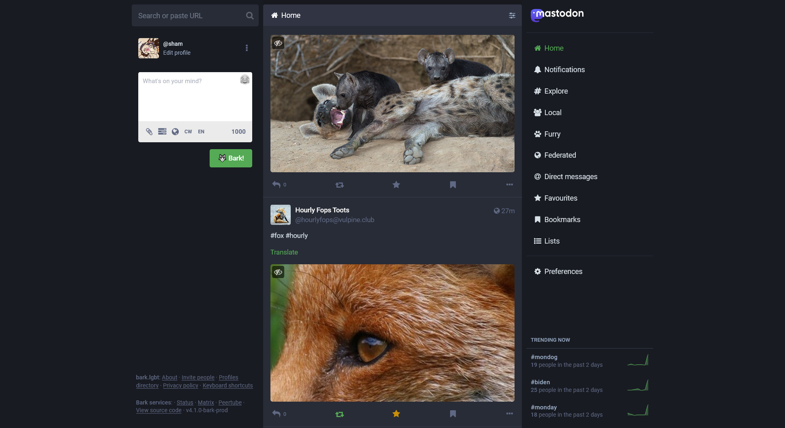
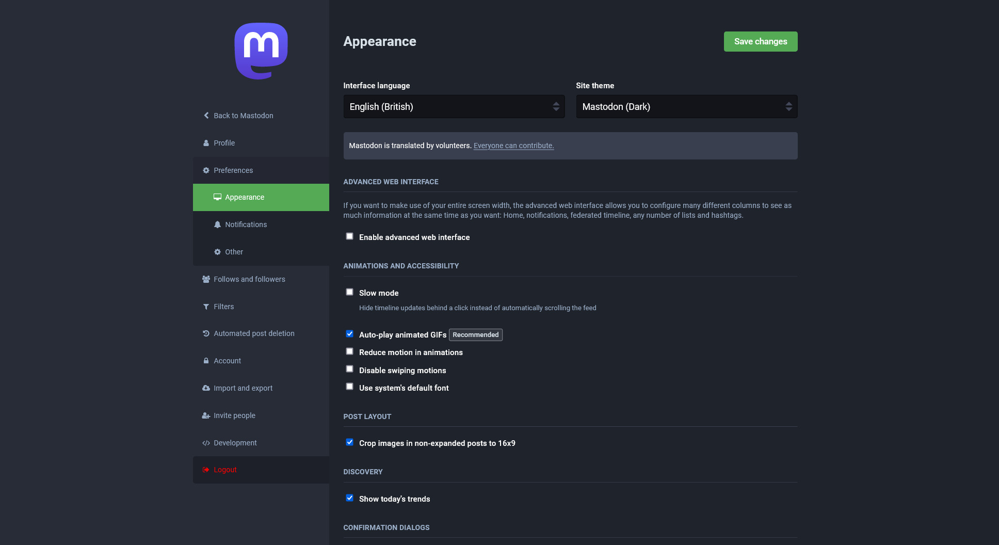
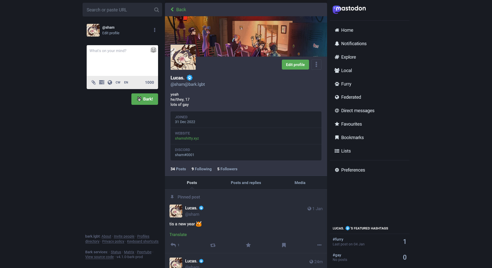

# bark.lgbt-theme

a theme for [bark.lgbt](https://bark.lgbt)
 
if there's anything wrong or there's anything you would like changed, open an issue :)

### Previews

### Installation
[Stylus](https://userstyles.world/api/style/8675.user.css)
 
_or just copy the css contents and put them into a Stylus theme yourself_